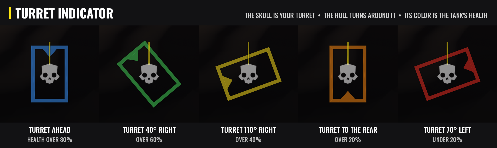

# Armored Overhaul


*Main battle tank upgrades for the TD-220 Bastion and TD-110 Maelstrom, for Helldivers 2.*

Armored Overhaul makes the Bastion and Maelstrom feel like real main battle tanks, and keeps the FRVs on their wheels. Every part is its own option, so you pick what you want in your mod manager.


## Features

- **Tank power:** more engine pulling power, so the tanks get off the line, up slopes and through rough ground quicker. Pick *Strong* (1.25 times the game's), *Stronger* (1.5 times) or *Strongest* (twice). Top speed stays the game's own.
- **Tank grip:** more track grip, so the tanks hold their line on slopes and in turns instead of sliding. Pick *Moderate* (1.25 times the game's grip), *Strong* (1.5 times) or *Maximum* (twice).
- **Tank steering:** quicker steering response: the tanks start and stop turning sooner, so they turn in place and change direction more readily. Pick *Responsive* (1.25 times the game's), *Quick* (1.5 times) or *Sharp* (twice).
- **Tank suspension:** stiffer, better damped suspension, with less bouncing and body roll. Pick *Firm* (springs a third stiffer, three times the bump damping) or *Heavy* (springs two thirds stiffer, six times the bump damping, for a planted, heavy ride).
- **MBT Turrets:** the gun turns all the way round, and the whole top of the tank turns with it like a real main battle tank turret. The new turrets are built from the game's own tank models and armor, so they look like they came with the game. The guns can also aim lower (6 degrees below level, twice the game's 3), and the gunner view turns with the turret. On the Maelstrom the missile pods ride on the back of the turret and the smoke launchers turn with it too.
- **Turret traverse:** how fast the turret turns side to side. Pick *Quick* (1.25 times the game's 25 degrees a second), *Fast* (1.5 times) or *Very fast* (twice). Works with or without MBT Turrets.
- **Turret elevation:** how fast the gun moves up and down. Pick *Quick* (1.25 times the game's 35 degrees a second), *Fast* (1.5 times) or *Very fast* (twice).
- **Turret aim range:** how far down and up the gun aims, and the gunner view follows. Pick *Wider* (10 degrees below level to 35 above) or *Widest* (15 below to 45 above). The game's own is 3 below to 25 above.
- **Turret indicator:** while you sit in the tank, a small tank outline on your screen shows which way the turret points compared to the hull, like a real tank's display. The Helldivers skull is your turret and always points up, and the hull turns around it with a marker at its front. The outline is drawn thick, like the tank's armor, and its color is the tank's health: blue, then green, yellow, orange and red as it takes damage. With Gunner Drive it sits just left of the driver panel; you can also place it yourself, resize it and fade it.
- **Gunner Drive:** drive the tank from the gunner seat when nobody is in the driver seat. You stay the gunner: the turret HUD, camera and fire keys work as normal while your movement keys drive the tank, and the engine starts the game's own way when you set off. When a teammate gets in the driver seat, they take over. While you drive, a driver panel like the game's own driver HUD shows in the game's own HUD font: the gear selector (R N D 1 2) with the one you're in lit up, the gear, an rpm bar, your speed and a fuel bar. The keyboard's gear keys (CTRL and shift) are shown only while you play on keyboard. In the Maelstrom, **Mouse 3** (middle click, or the **left stick click** on a controller) pops the smoke screen, which normally only the driver can use, and the panel shows the smoke rounds left.
- **Gunner camera:** the gunner camera sits lower and further behind the turret than the game's, rising only a little as it goes back, so you see more of the tank and around it, and it stays behind the turret as the turret turns. Pick *Close* (about 1 m behind and 1.4 m up, the game's distance but lower), *Far* (3.5 m behind), *Farther* (5.4 m) or *Farthest* (7.4 m).
- **FRV stability:** the M-102 FRV, M-103 Supply FRV and M-104 incendiary FRV stay on their wheels over rough ground, jumps and hard turns: the soft front suspension gets the rear's damping, the center of mass sits lower and the chassis resists rolling. Pick *Mild* (still lively, far less likely to roll), *Stable* (stays on its wheels, still slides and drifts) or *Planted* (very hard to roll, feels heavier in turns). Mass, grip, speed and steering stay the game's own.


## Options (Arsenal / HD2 Mod Manager)
Each option and each of its choices has its own icon in the mod manager. The options are grouped: the tanks' handling first, then the turret, then the gunner seat, then the FRV.

- **Tank power** - choose *Strong*, *Stronger* or *Strongest*, or turn it off for the game's own engine.
- **Tank grip** - choose *Moderate*, *Strong* or *Maximum*, or turn it off for the game's own grip.
- **Tank steering** - choose *Responsive*, *Quick* or *Sharp*, or turn it off for the game's own steering.
- **Tank suspension** - choose *Firm* or *Heavy*, or turn it off for the game's own suspension.
- **MBT Turrets** - the 360 degree turret and the new turret models. Turn it off and the tanks and their turrets are the game's own again.
- **Turret traverse** - choose *Quick*, *Fast* or *Very fast*, or turn it off for the game's own speed.
- **Turret elevation** - choose *Quick*, *Fast* or *Very fast*, or turn it off for the game's own speed.
- **Turret aim range** - choose *Wider* or *Widest*, or turn it off for the game's own range.
- **Turret indicator** - the turret direction and health display. Only you see it.
- **Gunner Drive** - drive from the gunner seat when you're alone in the tank, with the driver panel.
- **Gunner camera** - choose *Close*, *Far*, *Farther* or *Farthest*, or turn it off for the game's own gunner camera.
- **FRV stability** - choose *Mild*, *Stable* or *Planted*, or turn it off for the game's own FRV handling.



## Turret indicator and driver panel settings
The Turret indicator creates *ArmoredOverhaul-TurretIndicator.cfg* in `%LOCALAPPDATA%\CowboyBingus\Helldivers2\Logs` (type %LOCALAPPDATA% into the File Explorer address bar and press Enter). *dock* = 1 (the default) puts it just left of the driver panel when Gunner Drive is installed; set *dock* = 0 to place it yourself with *x* and *y* (0 to 1, from the left and from the bottom). *size* sets how big it is, *opacity* how solid it is (1 = solid), *health* = 0 draws the outline gray instead of in the health colors, *skull* = 0 swaps the skull for a plain octagon, *flip* = 1 turns the outline round if it ever shows the tank backwards, and *mirror* = 1 swaps its turning direction if it ever turns the wrong way (with the turret turned right, the hull's front marker should be on the left). Gunner Drive's driver panel has its own file in the same folder, *ArmoredOverhaul-DriverPanel.cfg*: *show* = 0 turns it off, *x* and *y* place its center, *size* sets its size, *opacity* how solid it is, and *game_font* = 0 swaps the game's HUD font for simple built-in letters. Saved changes show within a few seconds. Delete a file to get its defaults back.

## Requirements
[Bingus Shared Loader](https://www.nexusmods.com/helldivers2/mods/16292) v15 or newer, last in the load order. Every option except Tank suspension and FRV stability needs it.

## Download

Get the latest zip from the [Releases page](../../releases) (the Armored-Overhaul-<version>.zip file, not the source code). The mod is also on [AyakaMods](https://ayakamods.com).

## Install / update

1. Install Bingus Shared Loader v15 or newer.
2. Add Armored-Overhaul-2.0.0.zip in Arsenal or the HD2 Mod Manager and check the options you want.
3. Deploy, then restart the game.

- Updating from 1.2: nothing to do; your settings are kept. The Turret indicator now sits next to the driver panel; set *dock* = 0 in its settings file to keep your own place. The new options start turned off, so check the ones you want.
- Updating from 1.1: nothing to do; your Turret indicator settings are kept.
- Updating from 1.0: grip is now picked in the mod manager, so the old *ArmoredOverhaul-TankHandling.cfg* is no longer used and can be deleted.

## Uninstall
Remove it in your mod manager and deploy. Nothing is left behind in the game; the settings files and logs stay in the Bingus logs folder and can be deleted.

## Compatibility

- Don't combine it with other mods that change the Bastion or Maelstrom turrets, models, handling or suspension (for example casemate or traverse turret mods, tank model replacers or tank reskins that replace the hull models), or with other drive-from-the-gunner-seat or gunner camera mods. Turn off the matching option instead if you want to keep another mod.
- FRV stability changes the same files as other FRV handling or anti-flip mods; use one or the other.
- The exosuits are not changed.
- Made and tested on the September 2026 game version.

## Known limitations

- Only you see the new turret models and the turret indicator; other players see the normal tanks.
- The turret armor always looks undamaged (the hull still shows damage as normal).
- With two of the same tank out, the turret indicator follows the one nearest your camera.
- Gunner Drive only works while nobody is in the driver seat. In multiplayer, the player who drove the tank last keeps control of it after getting out, so Gunner Drive can't move it; the driver panel then says another player controls the tank. Take the driver seat once, then go back to the gunner seat, and it's yours again.
- Smoke from the gunner seat has been tested in my own games (solo and hosting). If it does nothing when you join someone else's game, please attach ArmoredOverhaul-GunnerDrive.log.
- A player reported another player's Maelstrom showing only its turret up close in multiplayer. I'm looking into it; if it happens to you, turning off MBT Turrets brings the normal tank back, and a note of which camo it wore helps.
- After a game update, the script options find what they need again by themselves. If an update changes the tanks' or FRVs' own models or physics, MBT Turrets, Tank suspension and FRV stability need an update from me, and I check this after every game patch.

## How it works

- **Tank power, Tank grip and Tank steering:** a Lua addon scales the tanks' engine torque, friction multiplier or steering rate in the game's own vehicle settings.
- **Tank suspension and FRV stability:** changed spring, damping, center of mass and roll values in the vehicles' own physics files.
- **MBT Turrets, Turret traverse, Turret elevation and Turret aim range:** one shared Lua addon changes the guns' turn limits, turn speeds and aim range in the game's own turret settings; MBT Turrets adds new tank models where the top of the hull is attached to the turret.
- **Turret indicator:** a Lua addon reads the turret's angle from the tank and the tank's health the way the game's own driver HUD does, and draws the outline with the game's own on-screen drawing. The skull is a copy of the game's own Helldivers skull icon, shipped with the option because the game only loads its own copy in the menu.
- **Gunner Drive:** a Lua addon copies your movement keys into the tank's driver controls while the driver seat is empty, the same way the game does for a real driver, and starts the engine with the game's own engine switch. The smoke key hands the Maelstrom's smoke launcher to you for the moment you press it.
- **Driver panel:** part of Gunner Drive. It reads the gear, rpm and fuel from the tank, measures your speed from how far the tank moves, and writes them with the game's own HUD font.
- **Gunner camera:** a Lua addon changes the camera offset in the game's own gunner camera settings, and turns it with the turret while you sit in the gunner seat.

Everything is written from scratch and built from the game's own files. No DLLs are added and no game code is patched.

## Troubleshooting
Attach the logs to your bug report: *ArmoredOverhaul-TankPower.log*, *ArmoredOverhaul-TankHandling.log* (grip), *ArmoredOverhaul-TankSteering.log*, *ArmoredOverhaul-MBTTurrets.log* (all the turret options), *ArmoredOverhaul-TurretIndicator.log*, *ArmoredOverhaul-DriverPanel.log*, *ArmoredOverhaul-GunnerDrive.log* and *ArmoredOverhaul-GunnerCamera.log*. You'll find them in `%LOCALAPPDATA%\CowboyBingus\Helldivers2\Logs` (type %LOCALAPPDATA% into the File Explorer address bar and press Enter). They show the game version, what each option found and changed, the setting in use, and any errors.

## Building from source

The Lua options are plain Lua: `src/build.py` (Python 3 with Pillow) fills in the `.lua.in` sources, packs them and the option add-ons into Helldivers 2 patch archives, and writes the Arsenal / HD2 Mod Manager zip to `src/build/`.

MBT Turrets' tank models and the Tank suspension and FRV stability presets are built from the game's own files, so they aren't stored here. Take them from the release zip first:

```
cd src
python tools/unpack_release.py Armored-Overhaul-2.0.0.zip
python build.py release
```

The release zip it makes is the same one attached to each release (`python build.py` makes a test build with extra logging). `src_physics/` holds the scripts that make the suspension and FRV presets from the game's physics files, and `src_models/` the Blender scripts that build the turret models.

## Credits
- **CowboyBingus** - Bingus Shared Loader.
- **HD2SDK** (Blender add-on) and **Filediver** - the tools used to build the turret models from the game's files.
- **HD2 HUD+** - showed how to draw on screen and use the game's own HUD font from a Lua addon.

## Changelog

See [CHANGELOG.md](CHANGELOG.md).

## License

Copyright (c) 2026 Th3chef. All rights reserved. You're welcome to read the source, report bugs and suggest fixes, but please ask before reusing it or reuploading the mod. See [LICENSE](LICENSE).
