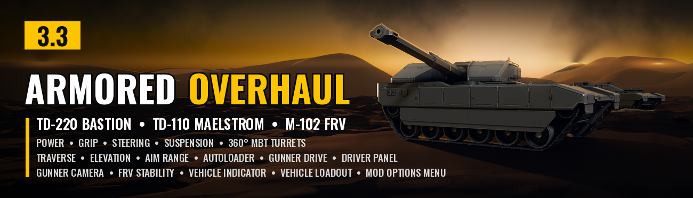
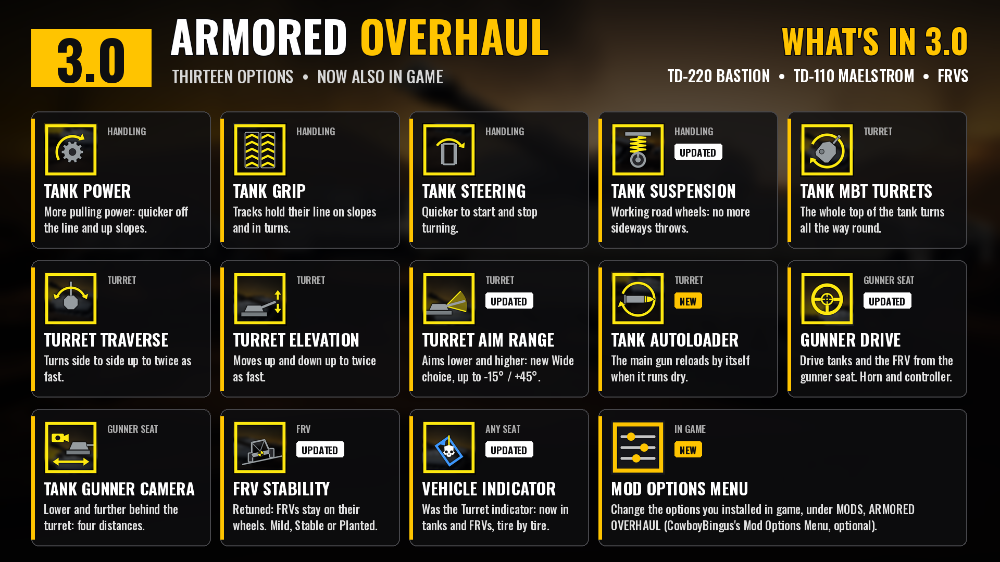
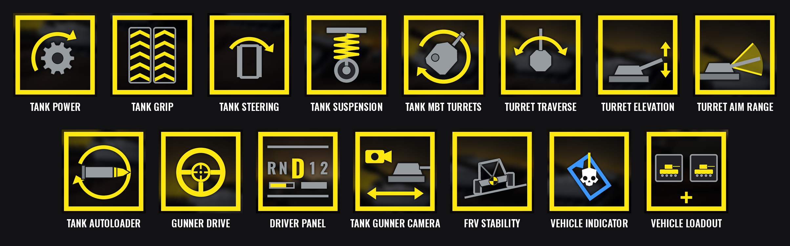
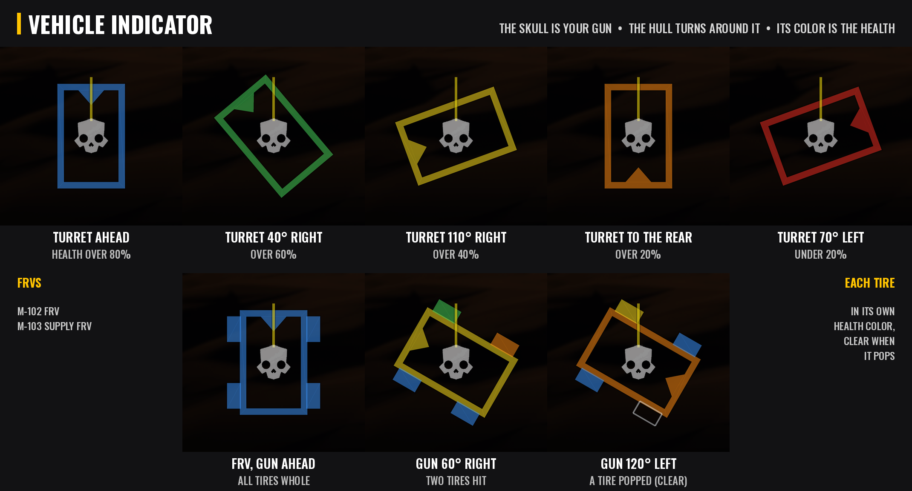

# Armored Overhaul



*Main battle tank upgrades for the TD-220 Bastion and TD-110 Maelstrom, and more for the FRVs, for Helldivers 2.*

Armored Overhaul makes the Bastion and Maelstrom feel like real main battle tanks and keeps the FRVs on their wheels. Every part is its own option, so you pick what you want in your mod manager, and with the Mod Options Menu you can change them in game too.



## Features

- **Tank Power:** more engine pulling power, so the tanks get off the line, up slopes and through rough ground quicker. Pick *Strong* (1.25 times the game's), *Stronger* (1.5 times) or *Strongest* (twice). Top speed stays the game's own.
- **Tank Grip:** more track grip, so the tanks hold their line on slopes and in turns instead of sliding. Pick *Moderate* (1.25 times the game's), *Strong* (1.5 times) or *Maximum* (twice).
- **Tank Steering:** quicker steering response: the tanks start and stop turning sooner. Pick *Responsive* (1.25 times the game's), *Quick* (1.5 times) or *Sharp* (twice).
- **Tank Suspension:** road wheels that work like a real tank's. In the game the tanks rest on their bump stops, so the wheels can't move; here each road wheel rests part-way down a longer travel and follows the ground, keeping its track down, and the hull no longer throws itself sideways or tips over when one track unloads. The tanks ride a little higher than the game's. Pick *Balanced* (half a metre of travel, soaks up rough ground) or *Planted* (stiffer and more damped, very hard to roll).
- **Tank MBT Turrets:** the gun turns all the way round, and the whole top of the tank turns with it like a real main battle tank turret. The new turrets are built from the game's own tank models and armor, so they look like they came with the game, and the gunner view turns with the turret. On the Maelstrom the missile pods ride on the back of the turret and the smoke launchers turn with it too.
- **Tank Turret Traverse:** how fast the turret turns side to side. Pick *Quick* (1.25 times the game's 25 degrees a second), *Fast* (1.5 times) or *Very fast* (twice). Works with or without MBT Turrets.
- **Tank Turret Elevation:** how fast the gun moves up and down. Pick *Quick* (1.25 times the game's 35 degrees a second), *Fast* (1.5 times) or *Very fast* (twice).
- **Tank Turret Aim Range:** how far down and up the gun aims, and the gunner view follows. Pick *Wide* (6 degrees below level to 30 above), *Wider* (10 below to 35 above) or *Widest* (15 below to 45 above). The game's own is 3 below to 25 above.
- **Tank Autoloader:** the Bastion's and Maelstrom's main gun reloads by itself when it runs dry, in the game's normal reload time (perks count). You can still reload by hand.
- **Gunner Drive:** drive from the gunner seat when nobody is in the driver seat, in the tanks, the M-102 FRV or both. You stay the gunner: the gun, its HUD and camera work as normal while your movement keys drive, and the engine starts the game's own way when you set off. When a teammate gets in the driver seat, they take over, and if you get out while the vehicle rolls it brakes to a stop (so you aren't thrown by the moving tank). While you drive, a driver panel like the game's own driver HUD shows the gear selector, the gear, an rpm bar, your speed and a fuel bar, in the game's own HUD font. **F** sounds the horn, and in the Maelstrom **Mouse 3** pops the smoke screen (the panel shows the smoke rounds left). On a controller the **left stick** drives (push it forward to drive forward, back to reverse, left and right to steer, even on the spot), its **click** sounds the horn and the **right stick click** pops smoke. With CowboyBingus's **Mod Bindings Menu** you can set your own keys for driving, the horn and the smoke (controls, tab MODS, section ARMORED OVERHAUL); the built-in keys keep working.
- **Tank Gunner Camera:** the gunner camera sits lower and further behind the turret than the game's, rising only a little as it goes back, so you see more of the tank and around it, and it stays behind the turret as the turret turns. Going uphill the view stays level; pointing downhill it follows the slope, so you can see the ground ahead. Pick *Close* (about 1 m behind), *Far* (3.5 m), *Farther* (5.4 m) or *Farthest* (7.4 m).
- **FRV Stability:** the M-102 FRV, M-103 Supply FRV and M-104 incendiary FRV stay on their wheels over rough ground, jumps and hard turns: a firmer front, longer suspension travel, a lower center of mass, more grip and weight, and a little more ground clearance. Pick *Mild*, *Stable* or *Planted*. Engine and steering stay the game's own.
- **Vehicle Indicator:** a small outline of your vehicle on screen shows which way the gun points compared to the hull, like a real tank's display, in any seat of the Bastion, the Maelstrom, the M-102 FRV and the M-103 Supply FRV. The Helldivers skull is the turret and always points up, and the hull turns around it. The outline's color is the vehicle's health: blue, then green, yellow, orange and red as it takes damage. On the FRVs each tire shows its own health and goes clear when it pops. With Gunner Drive it sits just left of the driver panel. Only you see it.



## Options (Arsenal / HD2 Mod Manager)
Each option and each of its choices has its own icon in the mod manager, in this order. Turn an option off to keep the game's own.

- **Tank Power** - *Strong*, *Stronger* or *Strongest*.
- **Tank Grip** - *Moderate*, *Strong* or *Maximum*.
- **Tank Steering** - *Responsive*, *Quick* or *Sharp*.
- **Tank Suspension** - *Balanced* or *Planted*.
- **Tank MBT Turrets** - the 360 degree turret and the new turret models.
- **Tank Turret Traverse** - *Quick*, *Fast* or *Very fast*.
- **Tank Turret Elevation** - *Quick*, *Fast* or *Very fast*.
- **Tank Turret Aim Range** - *Wide*, *Wider* or *Widest*.
- **Tank Autoloader** - the main gun reloads by itself.
- **Gunner Drive** - *Tanks and FRV*, *Tanks* or *FRV*, with the driver panel.
- **Tank Gunner Camera** - *Close*, *Far*, *Farther* or *Farthest*.
- **FRV Stability** - *Mild*, *Stable* or *Planted*.
- **Vehicle Indicator** - the gun direction and health display.



## Mod Options Menu (optional)
With CowboyBingus's **Mod Options Menu** installed, the options you installed also show in the game's options under MODS, ARMORED OVERHAUL, in the same order and with the same choices, plus Off. Each starts at what you picked in your mod manager. Changes take effect at once, with two exceptions: a new gunner camera distance is used the next time you take the gunner seat, and new power, grip or steering is used by tanks called in after the change. Tank Suspension and FRV Stability change the vehicles' own files, so they are picked in the mod manager only. Without the menu, everything works as picked in the mod manager.

## Requirements
- [Bingus Shared Loader](https://www.nexusmods.com/helldivers2/mods/16292) v15 or newer, last in the load order. Every option except Tank Suspension and FRV Stability needs it.
- Optional: CowboyBingus's Mod Options Menu, to change the options in game.
- Optional: CowboyBingus's Mod Bindings Menu, to set your own Gunner Drive keys.

## Download

Get the latest zip from the [Releases page](../../releases) (the Armored-Overhaul-<version>.zip file, not the source code). The mod is also on [AyakaMods](https://ayakamods.com).

## Install / update

1. Install Bingus Shared Loader v15 or newer.
2. Add Armored-Overhaul-3.0.1.zip in Arsenal or the HD2 Mod Manager and check the options you want.
3. Deploy, then restart the game.

Updating from 3.0.0: install it over 3.0.0, then look over your options (your mod manager may set them back to the first choice when it imports the update). Tank Suspension's *Firm* and *Heavy* are now *Balanced* and *Planted*: pick one again.

Updating from 2.0: install it over 2.0.1, then look over your options: several were renamed (they now start with "Tank", and the Turret indicator is now the Vehicle Indicator), Gunner Drive now lets you pick the tanks, the FRV or both, and Tank Autoloader is new. The Vehicle Indicator and driver panel no longer use settings files: *ArmoredOverhaul-TurretIndicator.cfg* and *ArmoredOverhaul-DriverPanel.cfg* in the Bingus logs folder are no longer read and can be deleted.

## Uninstall
Remove it in your mod manager and deploy. Nothing is left behind in the game; its logs stay in the Bingus logs folder and can be deleted.

## Compatibility

- Don't combine it with other mods that change the Bastion or Maelstrom turrets, models, handling or suspension (for example casemate or traverse turret mods, tank model replacers or tank reskins that replace the hull models), or with other drive-from-the-gunner-seat or gunner camera mods. Turn off the matching option instead if you want to keep another mod. If another mod keeps changing the same tank or camera values back, Armored Overhaul leaves them to it and says so in its log.
- FRV Stability changes the same files as other FRV handling or anti-flip mods; use one or the other.
- The exosuits are not changed.
- Made and tested on the September 2026 game version.

## Known limitations

- Only you see the new turret models and the Vehicle Indicator; other players see the normal tanks.
- The turret armor always looks undamaged (the hull still shows damage as normal).
- The M-104 incendiary FRV isn't in the game right now, so Gunner Drive and the Vehicle Indicator don't cover it yet (FRV Stability does).
- Gunner Drive only works while nobody is in the driver seat. In multiplayer, the player who drove a vehicle last keeps control of it after getting out, so Gunner Drive can't move it; the driver panel then says so. Take the driver seat once, then go back to the gunner seat, and it's yours again.
- After a game update, the script options find what they need again by themselves. If an update changes the vehicles' own models or physics, Tank MBT Turrets, Tank Suspension and FRV Stability need an update from me, and I check this after every game patch.

## How it works

- **Tank Power, Tank Grip and Tank Steering:** a Lua addon scales the tanks' engine torque, friction or steering rate in the game's own vehicle settings.
- **Tank Suspension and FRV Stability:** changed spring, damping, suspension travel, wheel mounts, grip, mass, center of mass and roll values in the vehicles' own physics files.
- **Tank MBT Turrets, Traverse, Elevation and Aim Range:** one shared Lua addon changes the guns' turn limits, turn speeds and aim range in the game's own turret settings; MBT Turrets adds new tank models where the top of the hull is attached to the turret.
- **Tank Autoloader:** when the main gun's magazine runs dry, it asks the game to start the reload, the same way the reload key does.
- **Gunner Drive:** a Lua addon copies your movement keys (or your left stick) into the vehicle's driver controls while the driver seat is empty, the same way the game does for a real driver, and starts the engine with the game's own engine switch. The horn and the smoke key use the game's own horn and the Maelstrom's own smoke launcher.
- **Driver panel:** part of Gunner Drive. It reads the gear, rpm and fuel from the vehicle, measures your speed from how far it moves, and writes them with the game's own HUD font.
- **Tank Gunner Camera:** a Lua addon changes the camera offset in the game's own gunner camera settings, and turns it with the turret while you sit in the gunner seat.
- **Vehicle Indicator:** a Lua addon reads the turret's angle and the vehicle's health (and the FRV's tires) the way the game's own driver HUD does, and draws the outline with the game's own on-screen drawing. The skull is a copy of the game's own Helldivers skull icon.

Everything is written from scratch and built from the game's own files. No DLLs are added and no game code is patched.

## Troubleshooting
Attach the logs to your bug report: *ArmoredOverhaul-TankPower.log*, *ArmoredOverhaul-TankHandling.log* (Tank Grip), *ArmoredOverhaul-TankSteering.log*, *ArmoredOverhaul-MBTTurrets.log* (all the turret options), *ArmoredOverhaul-GunnerDrive.log* (Gunner Drive, Tank Autoloader and the seat reader), *ArmoredOverhaul-DriverPanel.log*, *ArmoredOverhaul-GunnerCamera.log* and *ArmoredOverhaul-TurretIndicator.log* (Vehicle Indicator). You'll find them in `%LOCALAPPDATA%\CowboyBingus\Helldivers2\Logs` (type %LOCALAPPDATA% into the File Explorer address bar and press Enter). They show the game version, what each option found and changed, the choice in use, whether the Mod Options Menu was found, and any errors.

## Building from source

Each option's Lua addon is in `src/lua/` exactly as it ships; `src/build.py` (Python 3, no other packages) packs them into Helldivers 2 patch archives and writes the Arsenal / HD2 Mod Manager zip to `src/build/`, with the manifest, thumbnail and option icons.

The Tank MBT Turrets models, the Tank Suspension and FRV Stability presets and the turret skull are made from the game's own files, so they aren't stored here. Take them from the release zip first:

```
cd src
python tools/unpack_release.py Armored-Overhaul-3.0.1.zip
python build.py --check Armored-Overhaul-3.0.1.zip
```

`--check` compares the zip it makes with the release zip, file by file (every file is the same, byte for byte). `src_physics/` holds the scripts that make the suspension and FRV presets from the game's physics files, `src_models/` the Blender scripts that build the turret models, and `src/art/` how the pictures are made.

## Credits
- **CowboyBingus** - Bingus Shared Loader and the Mod Options Menu.
- **HD2SDK** (Blender add-on) and **Filediver** - the tools used to build the turret models from the game's files.
- **HD2 HUD+** - showed how to draw on screen and use the game's own HUD font from a Lua addon.

## Changelog

See [CHANGELOG.md](CHANGELOG.md).

## License

Copyright (c) 2026 Th3chef. All rights reserved. You're welcome to read the source, report bugs and suggest fixes, but please ask before reusing it or reuploading the mod. See [LICENSE](LICENSE).
